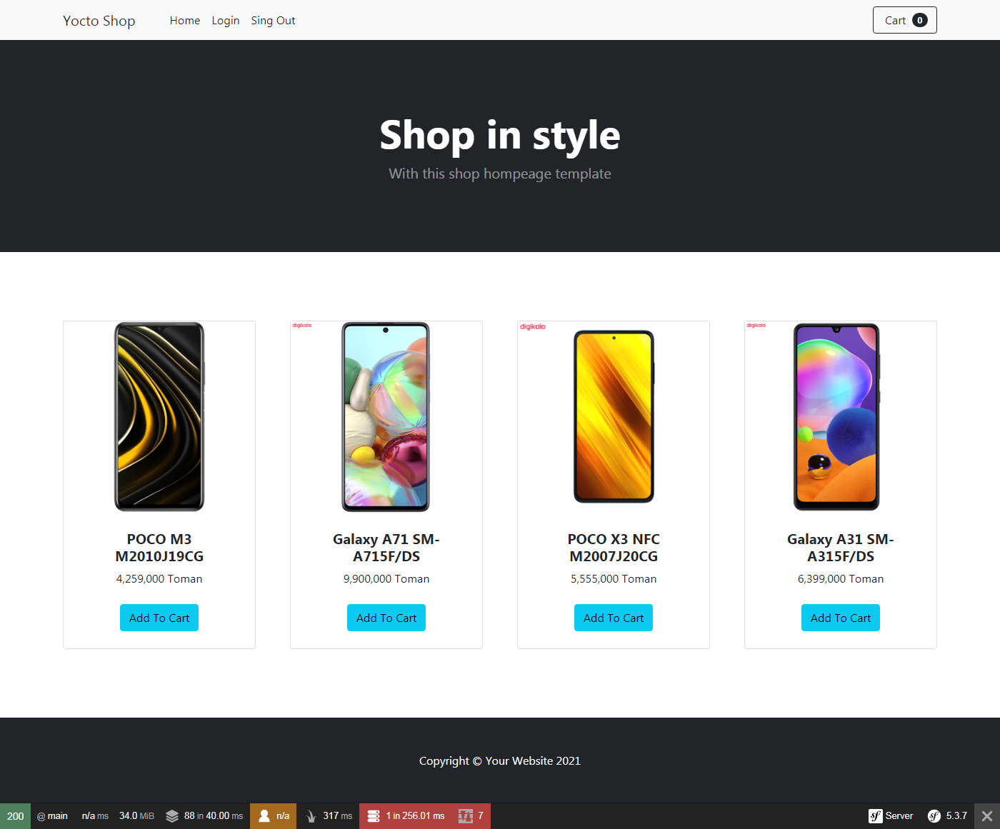

## Description
A shop app with php framework simple (Dashborda Admin, Login, Reg, Cart Shopping, ... )

<p align="center">
  
</p>

## Installation

```bash
$ composer install
```

## Migrations

```bash
# make new migration
$ php bin/console m:m
# migrate last migration
$ php bin/console d:m:m
```

## Running the app

```bash
# development with symfony cli:
$ symfony server:start
```

